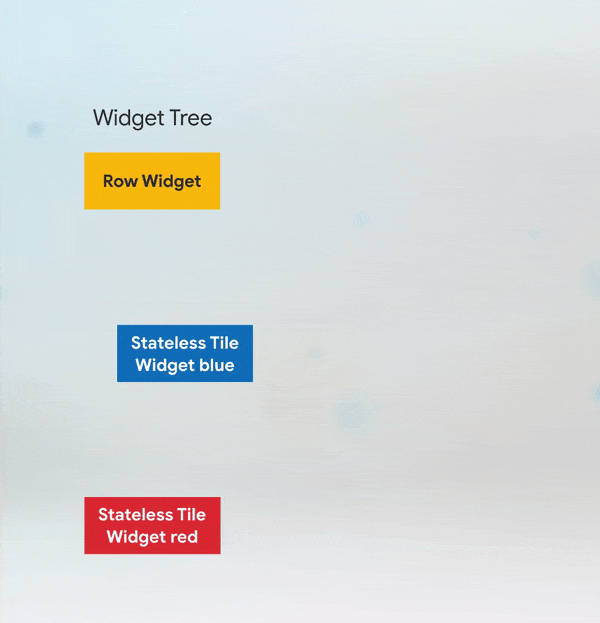
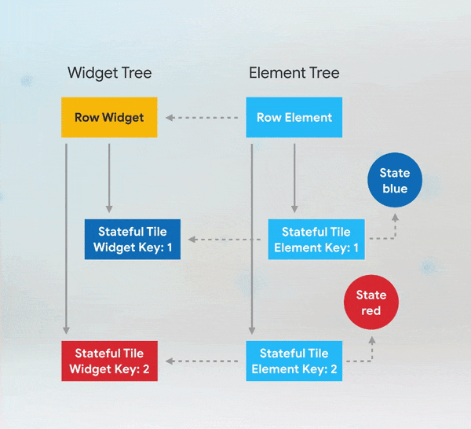

# Keys! What are they good for ?

Take note from: https://www.youtube.com/watch?v=kn0EOS-ZiIc

## The Inside Scoop on Keys

Most of the time, we don't need keys! But, 
`If you find yourself adding, removing, or reordering a collection of widgets of the same type that hold some state, using keys is likely in your future!`

More accurate is that when working with **StatefulWidget**.

Make an example with color swapping between 2 **StatelessWidget**:

```dart
void main() => runApp(new MaterialApp(home: PositionedTiles()));

class PositionedTiles extends StatefulWidget {
 @override
 State<StatefulWidget> createState() => PositionedTilesState();
}

class PositionedTilesState extends State<PositionedTiles> {
 List<Widget> tiles = [
   StatelessColorfulTile(),
   StatelessColorfulTile(),
 ];

 @override
 Widget build(BuildContext context) {
   return Scaffold(
     body: Row(children: tiles),
     floatingActionButton: FloatingActionButton(
         child: Icon(Icons.sentiment_very_satisfied), onPressed: swapTiles),
   );
 }

 swapTiles() {
   setState(() {
     tiles.insert(1, tiles.removeAt(0));
   });
 }
}

class StatelessColorfulTile extends StatelessWidget {
 Color myColor = UniqueColorGenerator.getColor();
 @override
 Widget build(BuildContext context) {
   return Container(
       color: myColor, child: Padding(padding: EdgeInsets.all(70.0)));
 }
}
```

But now we want to make **ColorfulTile** is **StatefulWidget**, ok then just change **Stateless** to **Stateful** right ?

```dart
class StatefulColorfulTile extends StatefulWidget {
 @override
 ColorfulTileState createState() => ColorfulTileState();
}

class ColorfulTileState extends State<ColorfulTile> {
 Color myColor;

 @override
 void initState() {
   super.initState();
   myColor = UniqueColorGenerator.getColor();
 }

 @override
 Widget build(BuildContext context) {
   return Container(
       color: myColor,
       child: Padding(
         padding: EdgeInsets.all(70.0),
       ));
 }
}
```

Oh trouble now, how many times we click, 2 widgets still unchanged. Ok let's add **Key** for each *StatefulColorfulWidget*. (Check code in **StatefulColorSwap.dart** file).

## Why Keys are Important

Under the cover, for **Widget** Flutter builds a corresponding **Element**. So **WidgetTree** is quite similar to **ElementTree** as a skeleton of our app.

In **Stateless** example, when we swap the order of the Tile widgets in the Row, Flutter walks the **ElementTree** to see if the skeletal structure is the same.



It starts with the **RowElement**, and then moves to its children. The **ElementTree** checks that the new widget is the same type and key as the old one, and if so, it updates its reference to the new widget. In the stateless version, the widgets **don’t have keys**, so Flutter just checks the type.

The **ElementTree** in **Stateful** is quite difference, there are also **State** objects pair with **TileElement**, and the color information is being stored there, not in the widgets themselves.

In the first **Stateful** example, when we swap the order of the Tile widgets in the Row, Flutter still walks the **ElementTree**, checks and updates the reference of **RowWidget**, the same with its children. Because Flutter uses the **ElementTree** and its corresponding **State** to show what on display. So what we get in first example is buggy.



With **Key** in second example, Flutter still walks the **ElementTree** but **TileElement** and **TileWidget** doesn't match. This causes Flutter to deactivate those elements and remove the references to the Tile Elements in the Element Tree, starting with the first one that doesn’t match.

Then Flutter walks through non-matched children of **RowElement** and find correct corresponding key. It finds a match, and updates its reference to the corresponding widget. And does it to all children widget.

## Where to put KEY

**Short answer:** if you need to add keys to your app, you should add them at the top of the widget subtree with the state you need to preserve.

Put example with previous Color-swap app, now we wrap up each **StatefulColorfulTile** in a *Padding*. If we still set **UniqueKey** inside **StatfulWidget**, then everytime we click the button, it'll create a new color tile. Because *key-matching* algorithm in Flutter only in a scoped, so just can check **Key** in the same *Padding*.

But if set **Key** for *Padding* then we'll swap *Padding* not *ColorTile*. Then algorithm runs and result is **ElementTree** reorders correctly.

